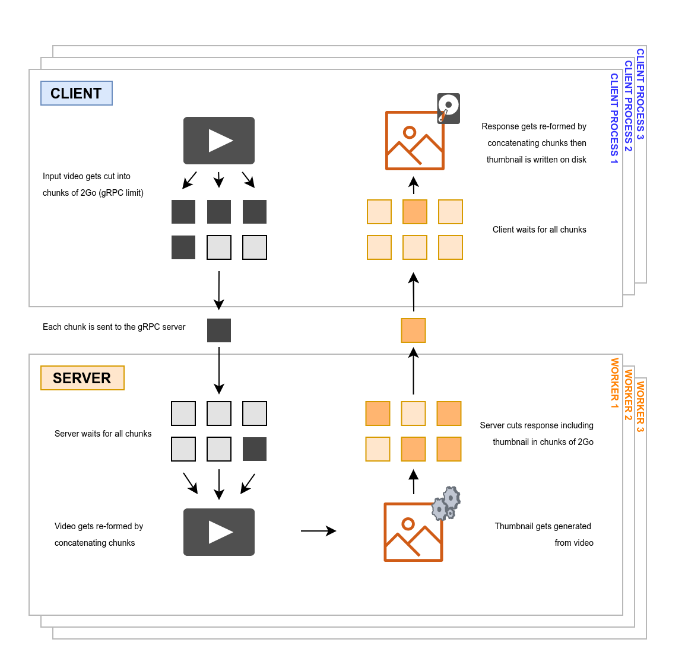

# gRPC multiprocessing with streams

This repo is a boilerplate showing how you can use multiprocessing with gRPC with streaming capabilities in Python

Streaming payloads allows **bypassing [gRPC's 2Go limit](https://stackoverflow.com/questions/34128872/google-protobuf-maximum-size)** in its Python implementation.

## Getting started

This project offers a minimum reproducible example of clients sending batches of videos to gRPC servers.

- Input : video(s)
- Output : thumbnail(s)

`client.py` starts a pool of several gRPC channels. Each client process is attributed a video and cuts it into chunks that are sent to one of the gRPC servers parallely to other client processes.

Response including thumbnail for each gets returned and cut if exceeding 2Go as well.



1. Adjust the `NUM_WORKERS` and `NUM_JOBS` variables in `docker-compose.yml` if desired

2. Add your videos in the `input/` directory. Thumbnails will be saved in `output/`.

  ```bash
  # Download 2 videos (to test multiprocessing)
  wget -O ./input/video.mp4 https://file-examples-com.github.io/uploads/2017/04/file_example_MP4_640_3MG.mp4
  wget -O ./input/video_2.mp4 https://file-examples-com.github.io/uploads/2017/04/file_example_MP4_640_3MG.mp4
  ```

3. Start playing around by running :

  ```bash
  docker-compose build
  docker-compose run client
  ```

## Re-compile proto

You must have `python3` and `pip` installed

```bash
# In project root directory
python3 -m pip install grpcio==1.32.0 protobuf==3.12.2
python3 -m grpc_tools.protoc --proto_path=./grpc_config --python_out=./grpc_config --grpc_python_out=./grpc_config ./grpc_config/video_thumbnail.proto
```

## Credits

- This repo strongly builds on the great [fpaupier's gRPC-multiprocessing repo](https://github.com/fpaupier/gRPC-multiprocessing)
- [Implementing gRPC in Python by Velotio](https://www.velotio.com/engineering-blog/grpc-implementation-using-python)
- Video sample from [file-examples.com](https://file-examples.com/index.php/sample-video-files/)
